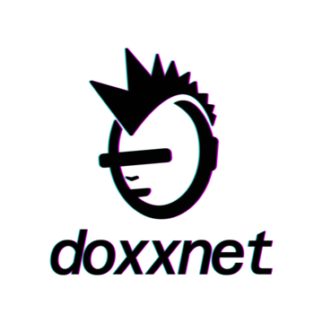

<picture>
  <source media="(prefers-color-scheme: dark)" srcset="assets/logo-light.png">
  <source media="(prefers-color-scheme: light)" srcset="assets/logo-dark.png">
  
</picture>

# doxx-skills

AI agent skills for setting up and managing [doxx.net](https://doxx.net) private networks through natural language.

No external dependencies: skills use `curl` for API calls. No Python, no servers, no daemons.

## Requirements

- A doxx.net account (create one at [a0x13.doxx.net](https://a0x13.doxx.net))

## Getting Started

### Claude Code

**CLI:**

```bash
claude /plugin marketplace add doxxcorp/doxx-skills
claude /plugin install doxxnet
```

**VS Code / Cursor:**

1. Open the plugin manager with `/plugins`
2. Switch to the **Marketplaces** tab and click **Add**: enter `doxxcorp/doxx-skills`
3. Switch to the **Plugins** tab and search for "doxx": **doxxnet** will appear
4. Click **Install** and choose your scope

Use any skill as a slash command:

```
/doxxnet:network-wizard
```

On first use, the skill will ask for your auth token. It validates it and saves it locally to `~/.config/doxxnet/token`: no manual setup needed.

### OpenClaw

```bash
clawhub install doxxnet
```

Or from a local clone:

```bash
openclaw skill install ./openclaw/skills/doxxnet
```

Set your token via environment variable:

```bash
export DOXXNET_TOKEN=your-token
```

See [openclaw/README.md](openclaw/README.md) for full setup.

### Codex

Run Codex from a skill directory: it auto-loads `AGENTS.md` as its instructions:

```bash
export DOXXNET_TOKEN=your-token
cd codex/skills/doxxnet
codex
```

Or pass a request directly with `codex exec`:

```bash
codex exec "Show me my tunnels and bandwidth usage"
```

See [codex/README.md](codex/README.md) for full setup.

### Other Agents

Any AI agent with shell access can use the API reference directly:

- **[api/reference.md](api/reference.md)**: Condensed doxx.net API reference optimized for agent consumption

Point your agent at the reference file and provide your doxx.net auth token at runtime.

## What's Inside

Two commands cover everything, available across all three platforms:

| Command | What it does |
|---------|-------------|
| **doxxnet** | Manage anything: tunnels, firewall, domains, DNS blocking, IP addresses, devices, account, stats: just describe what you want |
| **network-wizard** | Guided setup: walks through auth, server selection, tunnel creation, mesh networking, client install, and optional domain/DNS/blocking config |

Skills call the doxx.net API directly via `curl`: no intermediate server, no background processes.

### Claude Code Plugin (`claude/`)

See the Getting Started section above for installation and usage.

### OpenClaw Skills (`openclaw/`)

Native [OpenClaw](https://openclaw.org) skills. Uses `$DOXXNET_TOKEN` environment variable. See [openclaw/README.md](openclaw/README.md).

### Codex Agent Skills (`codex/`)

Native [OpenAI Codex CLI](https://github.com/openai/codex) skills using `AGENTS.md` (auto-loaded on startup). Uses `$DOXXNET_TOKEN` environment variable. See [codex/README.md](codex/README.md).

### API Reference (`api/`)

- **api/reference.md**: Every doxx.net API endpoint with curl examples: works with any AI agent or can be followed manually

## Examples

```
Build me a private network
```
```
Set up a new tunnel in New York and install WireGuard on my Mac
```
```
Lease a dedicated IPv4 address for my iPhone tunnel
```
```
Show me my bandwidth usage for the last 7 days and any security alerts
```
```
Block ads and tracking on all my tunnels
```
```
Add a firewall rule to open port 443 TCP on my home tunnel
```
```
Register a .vpn domain and create an A record pointing to my tunnel IP
```
```
Link all my tunnels together for mesh networking
```
```
Show me which devices are connected and when they last checked in
```
```
Rotate my static IP address and update any DNS records that reference it
```
```
Set up my tunnel in the WireGuard app on my phone
```

## How It Works

doxx.net is anonymous by design. There are no usernames, passwords, or emails. Your auth token **is** your identity.

1. You create an account at [a0x13.doxx.net](https://a0x13.doxx.net) (human-only, proof-of-work gated)
2. You give your auth token to the agent
3. The agent makes API calls on your behalf: your token stays on your machine, nothing is stored in this repo

## Known Limitations

### Claude Code

- **Uninstall only works for user scope from the UI.** "Install for this project" and "Install locally" cannot be uninstalled from the `/plugin` UI due to [upstream scope-tracking bugs](https://github.com/anthropics/claude-code/issues/14202) in Claude Code's plugin system ([#14202](https://github.com/anthropics/claude-code/issues/14202), [#26513](https://github.com/anthropics/claude-code/issues/26513), [#25613](https://github.com/anthropics/claude-code/issues/25613)). Use the CLI as a workaround:

  ```bash
  claude plugin uninstall doxxnet@doxx-skills --scope project
  claude plugin uninstall doxxnet@doxx-skills --scope local
  ```

## License

MIT
